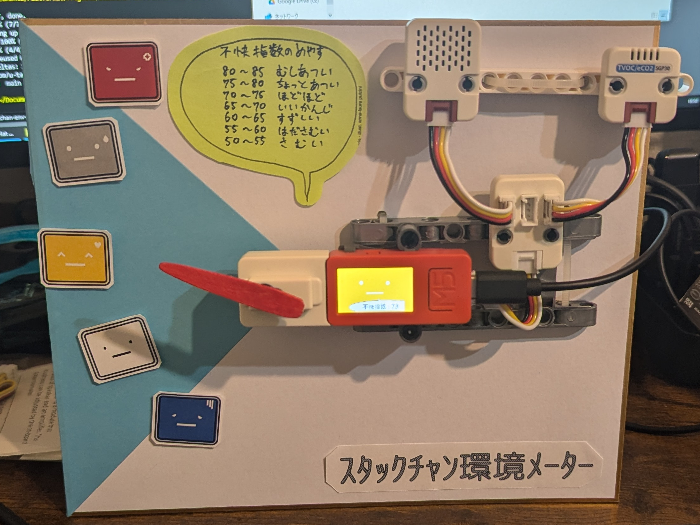
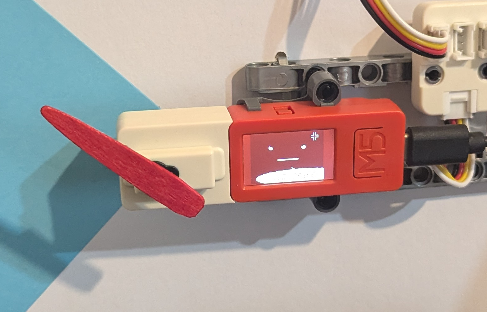

# stackchan-env-sensor-meter

## ｽﾀｯｸﾁｬﾝ環境ﾒｰﾀｰとは

温湿度計から不快指数を計測してアナログメーターで視覚的に表示するためのプログラムです。

## 想定機材

- [M5Stick-C Plus](https://www.switch-science.com/products/6470)
- [M5Stack用温湿度気圧センサユニット Ver.3（ENV Ⅲ）](https://www.switch-science.com/products/7254?_pos=2&_sid=5f059149a&_ss=r)
- [TVOC/eCO2 ガスセンサユニット（SGP30）](https://www.switch-science.com/products/6619)
- [M5StickC Servo Hat](https://www.switch-science.com/products/6076)

## 動作仕様

- 各種センサユニットで、周辺環境を計測
  - 30秒ごとに計測
- 温・湿度を元に不快指数を計算
  - 不快指数の計算式は[広く一般に使われている式](https://ja.wikipedia.org/wiki/%E4%B8%8D%E5%BF%AB%E6%8C%87%E6%95%B0) を利用
- 不快指数の値を元にサーボハットの角度に変換して物理メーターの針を回転
- M5Stick-C PlusのLCDディスプレイに[m5stack-avatar](https://github.com/stack-chan/m5stack-avatar)を表示
  - 手乗りロボット「ｽﾀｯｸﾁｬﾝ」の顔でもあるため、分かりやすさのため本プロジェクトも「ｽﾀｯｸﾁｬﾝ」を冠させていただいてます。
  - 基本的なコードはM5Stick-CではなくM5Stack Core系でも動作すると思います（サーボハットはM5Stick専用のため要改造）。
- 不快指数に合わせて[m5stack-avatar]の顔色と表情も変化
- 不快指数以外にも気圧や二酸化炭素濃度も計測できるため、M5Stick-C PlusのLCDディスプレイに順次表示

## 組み立て例

環境センサー計として、壁やパネルなどに固定して使うのが良いと思います。

冒頭の完成図を再掲します。

不快指数に合わせて[m5stack-avatar]の顔色と表情も変化した例

物理メーターの針がさす不快指数アイコンはお好みで色々差し替えられると楽しいかも

